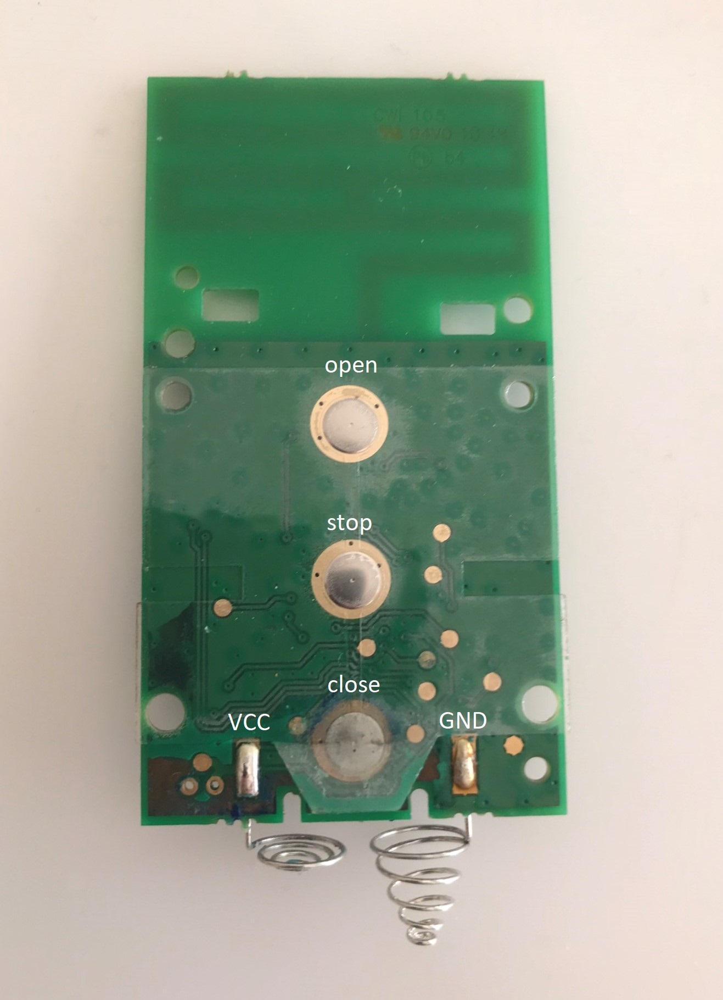

# VELUX INTEGRA® Control
This repo contains python scripts to control VELUX INTEGRA products by controlling the remote control (860963, KLI 310/311/312/313) via the GPIO pins of a Raspberry Pi. A script can automatically create cronjobs so that a shutter opens at sunrise and closes at sunset.


## Scipts
script | description
------ | ------
``` shutter_open.py t, shutter_stop.py, shutter_close.py t```   | open, stop, close shutter  (optional argument with duration in seconds, default is 0.2s)
``` start_sun_automation.py, stop_sun_automation.py ``` |  start/stop sun dependent control (change coordinates in ```sun_event/sun_event.py```)

## Wiring
Here you can see the wiring with the KLI 310. The KLI 311/312/313 versions work the same with the difference that they are only compatible to a specific product category (see imprinted logo).


In case you have an 860963 (is no longer sold but is compatible with KLI models) you have to remove the bord from the case, remove the foil with the three metal plates from the back.
Then solder your cables to the inner contacts.



## How it works
The Raspi provides the supply voltage so that batteries are no longer necessary.
The GPIOs which are connected to the button pins of the remote control are set to high. To simulate a keystroke, the corresponding GPIO is set to low and back to high.
Manual operation via the physical buttons is still possible.

## My setup
Here you can see my setup with a Raspberry Pi 3 Model B and a KLI 313 controlling two solar shutters.
