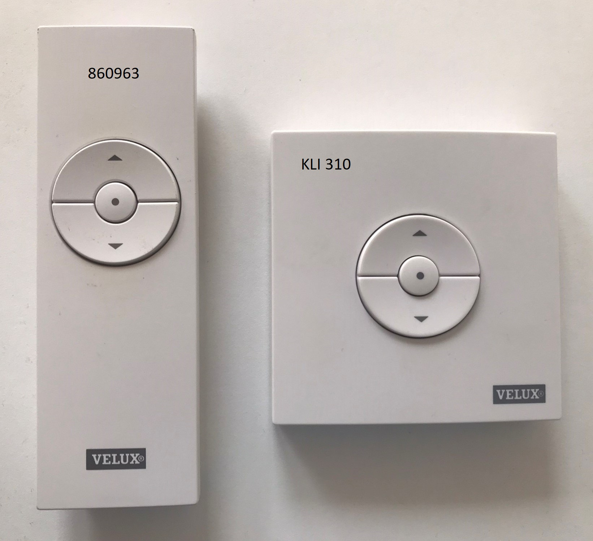
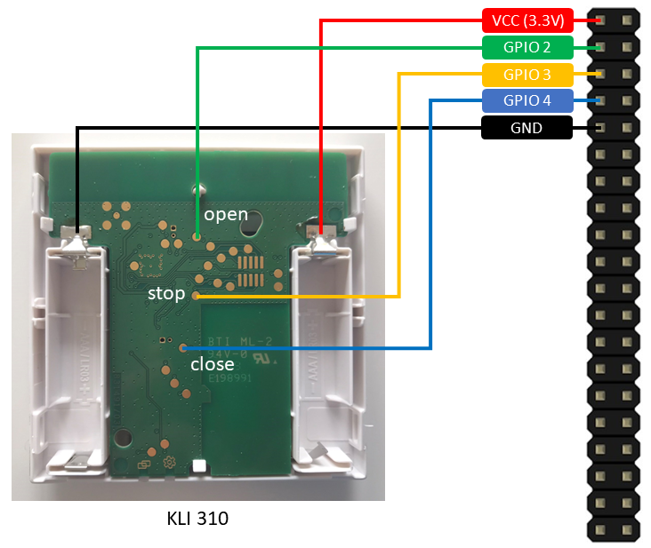
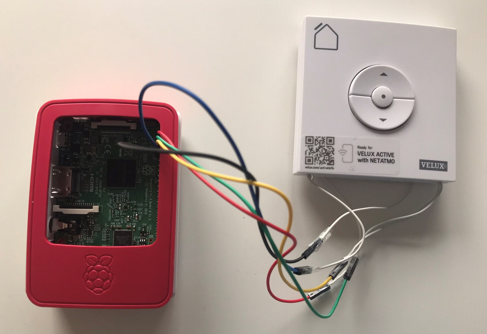

# VELUX INTEGRA® Control
This repo contains python scripts to control VELUX INTEGRA products by controlling the remote control (860963, KLI 310/311/312/313) via the GPIO pins of a Raspberry Pi.

## Wiring
Here you can see the wiring with the KLI 310. The KLI 311/312/313 versions work the same with the difference that they are only compatible to a specific product category (see imprinted logo).

In case you have an 860963 (is no longer sold but is compatible with KLI models) you have to remove the bord from the case, remove the foil from the backside with the three metal plates.
Then solder your cables to the innter contact.

## How it works
The Raspi provides the supply voltage so that batteries are no longer necessary.
The GPIOs which are connected to the button pins of the remote controll are set to high. To simulate a keystroke the corresponding GPIO is set to low and back to high.
Manual operation via the physical buttons is still possible.

## My setup
Here you can see my setup with a Raspberry Pi 3 Model B and a KLI 313.
